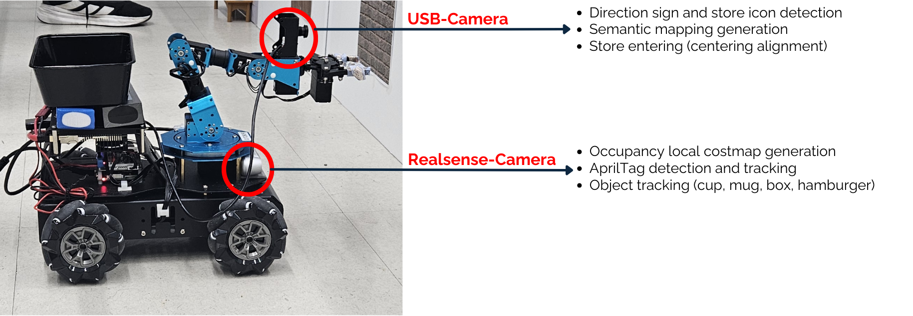
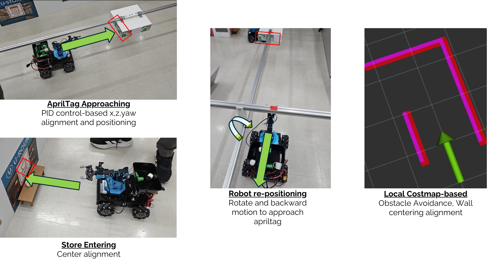
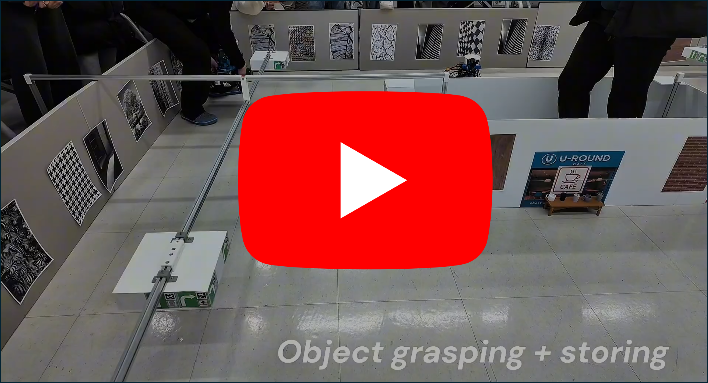

# LLM-Based Agentic Exploration in Real Environment

This repository contains the **real-environment** implementation of our **LLM-based agentic exploration** system for a mobile manipulator robot that navigates a corridor-style “shopping” layout, builds/uses semantic cues (e.g., store icons / signboards / AprilTags), and executes **end-to-end tasks from user instruction to object pickup**.

📝 You can read the full article here:  
👉 [Arxiv](https://arxiv.org/pdf/2601.00555)

---

## Real-World Testbed

<p align="center">
  
  <br/>
  <em><b>Figure 1.</b> Real-world corridor testbed used for evaluation, containing store entrances/signboards and junctions for exploration and task execution.</em>
</p>

---

## Hardware Overview (Two-Computer Robot)

Our robot uses **two onboard compute units**:
- **Jetson Nano**: runs perception (YOLO), navigation/decision stack, and publishes motion/action commands.
- **ArmPi Pro**: runs the arm/gripper stack and bridges base/arm control (executes grasp routines and receives velocity commands from Jetson).

<p align="center">
  
  <br/>
  <em><b>Figure 2.</b> Sensor and camera responsibilities. The USB camera supports signboard/store-icon perception and store-entry alignment, while the RealSense RGB-D supports local costmap perception, AprilTag detection, and grasp-target tracking.</em>
</p>

---

## Motion & Behavior Primitives

The system is modular: high-level decisions (LLM policy) trigger low-level ROS “skills” such as AprilTag approaching, local-costmap obstacle avoidance, and store-entry alignment.

<p align="center">
  
  <br/>
  <em><b>Figure 3.</b> Representative real-world motion strategies used for reliable execution: AprilTag approaching (PID alignment), robot re-positioning, and local costmap-based obstacle avoidance / corridor centering.</em>
</p>

---

## Key Features

- **Agentic exploration loop**: explore → map junction semantics → decide next action → execute skills
- **Semantic mapping**: JSON-like junction graph with direction-to-POI/store relations
- **LLM navigation policy (constrained output)**: outputs discrete action like `<direction>|||<store_action>`
- **Modular low-level controllers (ROS topics)**:
  - local-costmap **wall avoidance**
  - **AprilTag approach** for precise alignment at signboards/entrances
  - **store pre-enter / enter** routines (centering + entry)
  - **grasping trigger** (handoff to pickup/grasp node)

---

## System Overview (High-Level)

**Perception & Mapping**
- YOLO-based detection for **store icons / arrows / grasp targets** (and optional “negative” samples to reduce false positives)
- AprilTag detections used as **robust anchors** at junctions/entrances
- Local occupancy/costmap for safe corridor navigation

**Decision Layer**
- An LLM (or deterministic policy) selects **left/straight/right** and whether to **enter a store now** vs **continue**

**Execution Layer**
- A `MainController` FSM gates behaviors so only one module commands `/cmd_vel` at a time.

---

## Tech Stack

**Core**
- ROS (catkin workspace)
- Python 3

**Perception**
- Ultralytics **YOLO** (exported to **TensorRT engine** on Jetson)
- Dual-camera setup: **RealSense RGB-D** + **USB RGB**

**Localization / Cues**
- **AprilTag** detection (for anchoring and approach behaviors)

**Control**
- Modular ROS nodes (navigation primitives + grasping routines)
- Two-compute ROS networking (Jetson ↔ ArmPi)

**LLM**
- constrained high-level policy over the semantic map

---

## Running the Real Robot System

#### **1) ArmPi Pro Setup (Arm + Bridge)**
###### (a) Build catkin workspace
```bash
cd armpi_pro
rm -rf build devel
catkin_make
source devel/setup.bash
```
###### (b) Start function launcher
```bash
roslaunch armpi_pro_bringup start_functions.launch
```
###### (c) Start the main ArmPi programs in separate terminals 
```bash
cd armpi_pro/src/armpi_pro_demo

# Receives cmd_vel from Jetson and converts it to the ArmPi velocity interface
python3 cmd_vel_to_velocity.py

# Arm + gripper control (predefined grasp sequences) -> run this in a new terminal
python3 kinematics_demo.py
```

#### **2) Jetson Nano Setup (Perception + Policy)**
###### (a) ROS Master
```bash
roscore
```
###### (b) Convert YOLO .pt → TensorRT .engine
```bash
yolo export model=YOLO_Models/yolo_realsense.pt format=engine imgsz=640 half=True
yolo export model=YOLO_Models/yolo_usb.pt format=engine imgsz=640 half=True
```
###### (c) Run YOLO pipelines
```bash
# 1st terminal
python3 YOLO_Pipelines/yolo_realsense_camera.py
# 2nd terminal
python3 YOLO_Pipelines/yolo_usb_camera.py
```
###### (d) Main navigation / decision stack
```bash
cd catkin_ws
rm -rf build devel
catkin_make
source devel/setup.bash
roslaunch main_simulator main_launcher.launch 
roslaunch robot_controller main_controller.launch # separate terminal
```

---

## AprilTag Localization Setup (Required)

This project relies on **AprilTag-based localization** for robust alignment at junctions and store entrances.

Please install and configure **AprilTagLocalization** from the following repository:

🔗 https://github.com/MinSungjae/AprilTagLocalization/tree/master

**Notes:**
- Follow the repository instructions to install the package in your `catkin_ws`
- Configure the **AprilTag IDs and their fixed poses** to match the signboard and entrance placements in your Gazebo environment
- Ensure the published tag frames are consistent with your world/map frame before launching this project

---

## LLM Configuration
This project uses **GPT-4.1 (2025-04-14)** for high-level decision making. You must configure your API key to run the controller.

1. Navigate to the decision-maker directory:
   ```bash
   cd catkin_ws/src/robot_controller/scripts/robot_decision_makers
   ```
2. Create `.env` file and add your key:
   ```plain
   OPENAI_API_KEY=your_api_key_here
   ```

---

## Simulation Videos (YouTube)

A short demo video showcasing the end-to-end runtime in Real Environment:

[](https://www.youtube.com/watch?v=v-hS39ViajA)

- ▶️ Watch on YouTube: https://www.youtube.com/watch?v=v-hS39ViajA

